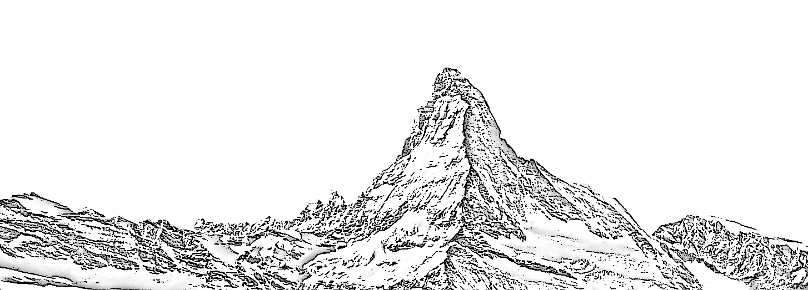

## Hi there, my name is Maxime 👋

#### Here you will find key projects I've worked on!

Curious about me ? Send me an e-mail at maxime.zammit at epfl.ch 
<!-- visit my website [here](#)-->
Want to connect ? 

### Current relevant project(s)
#### At NTU:
- 🎓 Working on my Master’s thesis. Updates coming soon!

### Past relevant projects
#### At ETH/EPFL:
- 263-4640-00L(MA3-ETH) - Network Security: implementing an ACME Client - (*TODO*)
- CS-498(MA2) - DEDIS/C4DT Semester Project: Contributing to D-Voting - ([Github](https://github.com/MaximeZmt/d-voting) | [Report](docs/MaximeZammit_MasterResearchProject_D-Voting.pdf) | [Slides](docs/MaximeZammitFinalSlides.pdf))
- HUM-410/414(MA1/MA2) - Droit et Technique I et II - ([Github](https://github.com/MaximeZmt/Droit-et-Technique-I-et-II) | [Report](https://github.com/MaximeZmt/Droit-et-Technique-I-et-II/blob/main/BrevetsEtBiotechnologiesVegetales_final.pdf) | [Slides](https://github.com/MaximeZmt/Droit-et-Technique-I-et-II/blob/main/BrevetsEtBiotechnologiesVegetales_slides.pdf))
- CS-398(BA6) - DEDIS Laboratory Semester Project: Contributing to POPstellar - ([Github](https://github.com/dedis/popstellar) | [Report](https://www.epfl.ch/labs/dedis/wp-content/uploads/2022/07/report-2022-1-PoP.pdf)) <!-- Archive Link if broken: https://web.archive.org/web/20240109220256/https://www.epfl.ch/labs/dedis/wp-content/uploads/2022/07/report-2022-1-PoP.pdf-->
- CS-306(BA6) - SoftwareDevelopmentProject: Vibester - ([Github](https://github.com/MaximeZmt/SDP_2022-Vibester/))
- CS-358(BA6) - Making Intelligent Things: Mind-Controlled Robot - ([Github](https://github.com/EPFL-EEG-Team) | [Report](https://github.com/EPFL-EEG-Team/.github/raw/main/EEG_Final_Report.pdf))
- HUM-380(BA6) -  Video games and gamification: Coolor, video game prototype on color theory - ([Github](https://github.com/RabbitStudiosCH) | [Report](https://github.com/RabbitStudiosCH/.github/raw/main/Rapport_Jeu_Video_Coolor_Groupe_1.pdf))
- CS-212(BA4) - System programming project: ImgStore - ([Github](https://github.com/MaximeZmt/CS212-ImgStore))
- CS-108(BA2) - Practice of object-oriented programming: Rigel - ([Github](https://github.com/MaximeZmt/CS-108-Rigel))
- CS-107(BA1) - Introduction to programming: Miniprojects - ([Github](https://github.com/MaximeZmt/CS107-Miniprojet1-2))

#### My Matura Project
- My Matura Project - Location Hunter - ([Github](https://github.com/MaximeZmt/LocationHunter))

#### Other
- Jumpbot - A smartphone game created with godot engine ([Github](https://github.com/MaximeZmt/jumpbot))

